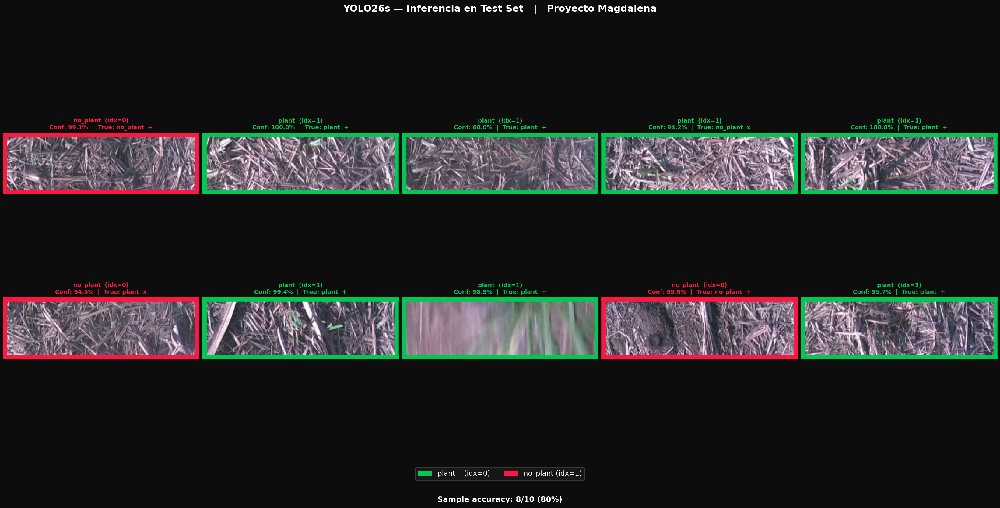
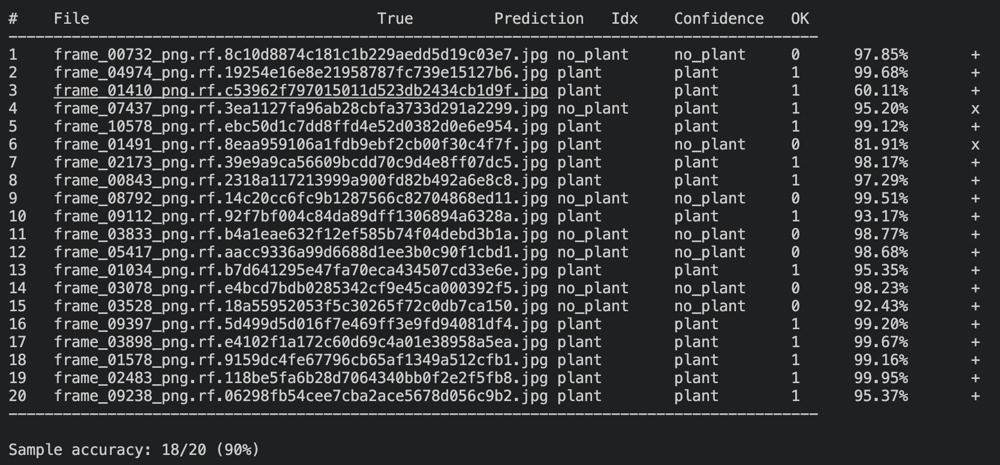
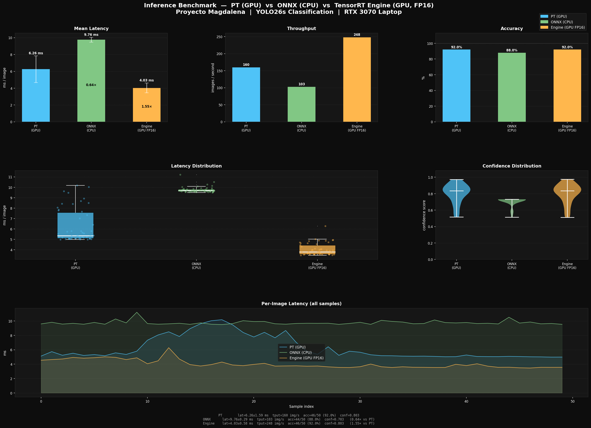

# Magdalena — Plant Classification with YOLO26s

Binary classification (`plant` / `no_plant`) of sugarcane row images
captured from a tractor under day and night conditions.

Project by the **Laboratory of Dynamic Systems and Control (LSDC-FISICC)**,
Universidad Galileo — Smart Fertilization, Ingenio Magdalena.

---

## Pipeline

```
Labelbox → get_data.py
               ↓
        verify_duplicates.py
               ↓
        pre_annotation_hsv.py   →   roboflow_upload/
               ↓
        reduce_and_shuffle_no_plant.py
               ↓
        (upload to Roboflow with augmentation)
               ↓
        dataset/  ← downloaded from Roboflow
               ↓
        ultralytics_yolov26_train.py
               ↓
        inference_test.py
               ↓
        inference_benchmark.py  →  inference_benchmark.png
               ↓
        convert2engine.py  →  best.engine  (Jetson Orin Nano)
```

---

## labelbox_utils/

The `labelbox_utils/` folder contains all scripts needed to **retrieve a previously uploaded dataset from Labelbox** and **prepare it for upload to Roboflow**. These scripts are not part of the training pipeline — they cover only the data acquisition and pre-processing stages that precede Roboflow.

### config.yml

All Labelbox scripts read credentials from `labelbox_utils/config.yml`. Fill it in before running any script in this folder:

```yaml
labelbox:
  api_key: "your_api_key_here"       # Labelbox API key (account settings)
  project_id: "your_project_id_here" # ID of the Labelbox project
  dataset_id: "your_dataset_id_here" # ID of the specific dataset to download
```

- `api_key` — authenticate against the Labelbox API.
- `project_id` — scope queries to a particular Labelbox project.
- `dataset_id` — target the exact dataset whose images you want to download.

To find `dataset_id` without leaving the terminal, run `get_dataset_id.py` (see below).

### Scripts

| Script | Purpose |
|---|---|
| `get_dataset_id.py` | Lists every dataset in the Labelbox account with its ID and name. Run this once to find the `dataset_id` you need to put in `config.yml`. |
| `get_data.py` | Downloads all images from the configured Labelbox dataset into `imagenes_labelbox/`. Skips files that already exist, so it is safe to re-run. |
| `verify_duplicates.py` | Detects and removes near-duplicate images inside `imagenes_labelbox/` using perceptual hashing (pHash, threshold ≤ 4). Reports unique vs. duplicate counts before deleting. |
| `pre_annotation_hsv.py` | Automatically labels each image as `plant` or `no_plant` using an HSV colour threshold (green range). Copies images into `roboflow_upload/plant/` and `roboflow_upload/no_plant/`, the folder structure Roboflow expects for classification datasets. |
| `reduce_and_shuffle_no_plant.py` | Randomly keeps 2,000 images in `roboflow_upload/no_plant/` and deletes the rest. Run after `pre_annotation_hsv.py` to balance the class distribution before uploading to Roboflow. |

**Typical execution order:**

```
get_dataset_id.py        ← find and set dataset_id in config.yml
       ↓
get_data.py              ← download images → imagenes_labelbox/
       ↓
verify_duplicates.py     ← clean near-duplicates
       ↓
pre_annotation_hsv.py    ← label and sort → roboflow_upload/
       ↓
reduce_and_shuffle_no_plant.py  ← balance no_plant class
       ↓
(upload roboflow_upload/ to Roboflow manually)
```

---

## Training and Deployment Scripts

The following three scripts work with the dataset **downloaded from Roboflow** (stored in `dataset/`) and cover the full lifecycle from training to edge deployment.

### ultralytics_yolov26_train.py

Runs the complete training and evaluation pipeline on the Roboflow-downloaded dataset. It executes four sequential phases:

1. **Training** — fine-tunes YOLO26s-cls on the `train` split with a rectangular trainer (320×96 px).
2. **Validation** — evaluates the best checkpoint on the `valid` split.
3. **Test** — evaluates on the `test` split.
4. **Plots** — saves a 2×3 metric grid (loss, LR, Top-1/Top-5, final table) to `saved_plots/`.

Outputs are written to `runs/classify/magdalena/plant_cls_v1/`.

### inference_test.py

Loads `best.pt` and runs inference on a random sample of 10 images from `dataset/test/`. Produces `inference_sample.png` in the project root — a grid showing each image with its predicted label and confidence, colour-coded green (`plant`) or red (`no_plant`).

Use this script to do a quick sanity check on the trained model before exporting.

### inference_benchmark.py

Benchmarks the trained model across three inference backends and produces a multi-panel comparison plot (`inference_benchmark.png`):

| Backend | Runtime | Device | Precision |
|---|---|---|---|
| **PT** | Ultralytics YOLO + PyTorch | GPU | FP32 |
| **ONNX** | ONNXRuntime | CPU | FP32 |
| **Engine** | Ultralytics YOLO + TensorRT | GPU | FP16 |

Requires `best.engine` to exist — export it first (see `convert2engine.py`). The number of benchmark images, warmup passes, and random seed are configurable at the top of the file.

### convert2engine.py

Exports `best.pt` to a TensorRT `.engine` file for deployment on a **Jetson Orin Nano**. It calls `model.export(format="engine", imgsz=320, device=0)` and requires an NVIDIA GPU with TensorRT installed. Place `best.pt` in the project root before running:

```bash
cp runs/classify/magdalena/plant_cls_v1/weights/best.pt .
python convert2engine.py
# produces best.engine
```

---

## System Requirements

| Component | Minimum | Recommended |
|---|---|---|
| Python | 3.8 | 3.11 |
| RAM | 8 GB | 16 GB |
| Storage | 5 GB free | 10 GB free |
| GPU | Optional | CUDA or Apple MPS |

---

## Python Dependencies

```bash
pip install "numpy<2.0" ultralytics torch torchvision matplotlib pandas opencv-python roboflow imagehash Pillow labelbox
```

> **Important:** `numpy<2.0` must be installed **before** the other dependencies
> to avoid the `RuntimeError: Numpy is not available` error.

### ONNX and TensorRT (required for `convert2engine.py`)

Export to TensorRT requires ONNX as an intermediate format. Install both before running `convert2engine.py`:

```bash
pip install onnx onnxruntime
```

TensorRT must be installed separately — it is **not** available via pip. Install the version that matches your CUDA and JetPack release:

- **Jetson Orin Nano (JetPack 6.x):** TensorRT is pre-installed. Verify with:
  ```bash
  python -c "import tensorrt; print(tensorrt.__version__)"
  ```
- **Desktop/server (CUDA):** Download TensorRT from the [NVIDIA Developer Portal](https://developer.nvidia.com/tensorrt) and follow the installation guide for your platform.

> **Note:** `convert2engine.py` calls `model.export(format="engine")`, which internally uses ONNX as an intermediate step before compiling the TensorRT engine. Both ONNX and TensorRT must be available on the device where you run the export.

---

## Platform Compatibility

### CUDA (laptop/desktop with NVIDIA)
```bash
python -c "import torch; print(torch.cuda.is_available())"
# True = ready to train with GPU
```

### Apple Silicon (M1/M2/M3)
```bash
python -c "import torch; print(torch.backends.mps.is_available())"
# True = hardware available
```

> **Important:** Even when MPS is available, the script uses `device="cpu"` because
> **MPS does not support BFloat16**, which is required by the YOLO26 MuSGD optimizer.

### CPU (Intel Mac or no GPU)
No additional setup required. The script detects the device automatically.

---

## Automatic Device Detection

The script selects the device in this priority order:

```
CUDA GPU  →  Apple MPS (falls back to CPU)  →  CPU
```

| Device | Batch size |
|---|---|
| CUDA | 32 |
| Apple Silicon (CPU) | 8 |
| CPU | 8 |

---

## Optimizer: MuSGD vs SGD

| Platform | `optimizer` | `device` | Reason |
|---|---|---|---|
| NVIDIA GPU (CUDA) | `"MuSGD"` | `0` | BFloat16 available on CUDA |
| Apple Silicon (M1/M2/M3) | `"SGD"` | `"cpu"` | MPS does not support BFloat16 |
| CPU (Intel Mac / no GPU) | `"SGD"` | `"cpu"` | No hardware acceleration |

To train on CUDA, change line 173 in [ultralytics_yolov26_train.py](ultralytics_yolov26_train.py):

```python
optimizer = "MuSGD",
```

---

## Dataset

Downloaded from Roboflow in **Folder Structure** format.
Augmentation was applied in Roboflow; no additional augmentation is applied during training.

```
dataset/
├── train/
│   ├── plant/        # 5,878 images
│   └── no_plant/     # 2,519 images
├── valid/
│   ├── plant/
│   └── no_plant/
└── test/
    ├── plant/
    └── no_plant/
```

| Split | Images |
|---|---|
| Train | 8,397 |
| Val | 799 |
| Test | 400 |
| **Total** | **9,596** |

---

## Model

| Parameter | Value |
|---|---|
| Architecture | YOLO26s-cls |
| Image size | 320×96 px |
| Classes | `plant`, `no_plant` |
| Epochs | 15 (patience 5) |
| Dropout | 0.3 |
| Weight decay | 0.001 |
| Learning rate | 0.001 |
| Optimizer | SGD (CPU) / MuSGD (CUDA) |

### Training Script Phases

The script runs 4 phases in sequence:

| Phase | Description |
|---|---|
| [1/4] Training | `model.train(...)` with RectTrainer (320×96) |
| [2/4] Validation | `model.val(split="val")` — Top-1 / Top-5 accuracy |
| [3/4] Test | `model.val(split="test")` — Top-1 / Top-5 accuracy |
| [4/4] Plots | Loss, LR, Top-1/Top-5, final metrics table |

---

## Output Structure

```
runs/classify/magdalena/plant_cls_v1/
├── weights/
│   ├── best.pt            ← final model for inference
│   └── last.pt
├── results.csv
├── confusion_matrix.png
├── results.png
└── saved_plots/
    ├── training_metrics.png   ← 2×3 plot with full metrics
    ├── confusion_matrix.png   ┐
    ├── results.png            ├── copies of all YOLO26-generated images
    └── ...                    ┘

inference_sample.png     ← output of inference_test.py (project root)
inference_benchmark.png  ← output of inference_benchmark.py (project root)
```

### Inference Sample





---

## Inference Benchmark

Run `inference_benchmark.py` to compare all three backends on 50 random test images
(10 warm-up passes excluded from timings). Measured on an **NVIDIA RTX 3070 Laptop GPU**.

| Backend | Mean Latency | Std | Throughput | Accuracy | Speedup vs PT |
|---|---|---|---|---|---|
| PT (GPU — PyTorch) | 6.26 ms | ±1.59 ms | 160 img/s | 92.0% | baseline |
| ONNX (CPU — ONNXRuntime) | 9.76 ms | ±0.29 ms | 103 img/s | 88.0% | 0.64× |
| Engine (GPU — TensorRT FP16) | **4.03 ms** | ±0.58 ms | **248 img/s** | **92.0%** | **1.55×** |

Key observations:
- The **TensorRT FP16 engine is 1.55× faster than PyTorch** with zero accuracy loss.
- ONNX runs on CPU only on this system (ORT CUDA requires libcublasLt.so.12; system ships CUDA 13). On a system with matching ORT-GPU dependencies it would outperform the CPU baseline.
- PT and Engine produce identical accuracy, confirming FP16 quantization has no cost for this task.



---

## Deployment on Jetson Orin Nano

```bash
# Copy the best model to the project root directory
cp runs/classify/magdalena/plant_cls_v1/weights/best.pt .

# Export to TensorRT (requires NVIDIA GPU on the Jetson)
python convert2engine.py
```

Produces `best.engine` from `best.pt` using TensorRT (device=0).
The script expects `best.pt` in the current working directory.

### Expected Inference Performance

Estimated latency on a **Jetson Orin Nano** running the TensorRT `.engine` model (FP16):

| Scenario | Latency | Throughput |
|---|---|---|
| Single image (batch=1) | ~2–4 ms | ~250–500 FPS |
| Sustained stream (full pipeline) | ~3–6 ms | ~170–330 FPS |

Key factors behind these estimates:
- Input resolution is 320×96 px (~61% of the typical 224×224 area), reducing compute proportionally.
- Classification-only inference has no NMS or box decoding overhead.
- TensorRT FP16 provides a 3–5× speedup over PyTorch FP32.
- Numbers apply to the Jetson Orin Nano 8 GB at 15 W power mode. The 4 GB / 7 W configuration will be somewhat slower.
- First inference after loading incurs a ~10–50 ms warmup; subsequent frames run at the rates above.

---

## References

- Dataset: LSDC-FISICC, Universidad Galileo — Smart Fertilization, Ingenio Magdalena
- Base model: [Ultralytics YOLO26](https://docs.ultralytics.com/models/yolo26/)
- Group: LSDC-FISICC
